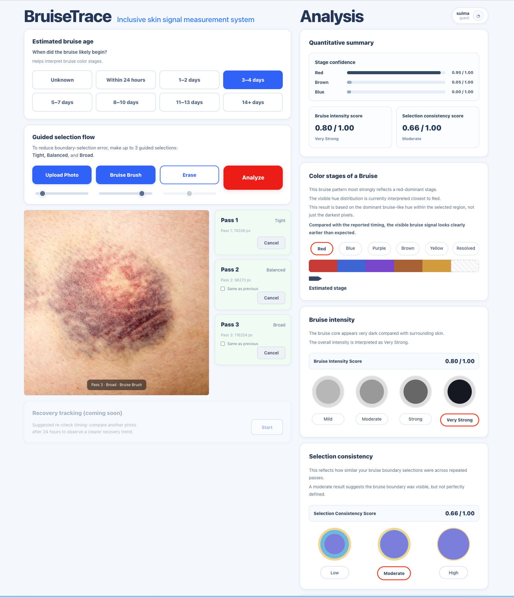

# BruiseTrace

AI-powered bruise analysis tool designed to support **inclusive skin tone assessment**.

BruiseTrace explores how image analysis and user-guided segmentation can help track bruise development more clearly across different skin tones.

## Prototype (v0.2)

Live demo  
https://bruisetrace.vercel.app

---

## Problem

Bruises can appear differently across skin tones and lighting conditions.  
Many visual assessment tools are not designed with inclusive skin analysis in mind.

BruiseTrace experiments with a simple approach:

- User-guided bruise region selection
- Color stage analysis
- Intensity scoring
- Selection consistency checking

---

## Features

- Guided bruise region selection
- Color stage estimation
- Bruise intensity score
- Selection consistency score
- Canvas-based image analysis

---

## Technology

- Next.js
- TypeScript
- Canvas image processing
- Vercel deployment

---

## Development Status

Current version: **v0.2 prototype**

Planned improvements

- Improved bruise stage classification
- Better color normalization across lighting
- More robust ROI detection
- Visual progress tracking across multiple images

---

## Future Development

- Bruise healing timeline estimation
- Multi-image comparison
- Medical research dataset testing
- Expanded inclusive skin tone calibration

---

## Project Goal

BruiseTrace is an experimental tool exploring how AI-assisted image analysis and human-guided input can support more equitable visual health assessment tools.
